Ciphey的概述

无论是在日常的渗透测试、代码审计等工作，亦或是在CTF竞赛中，总是能碰到一些不能一眼看出编码规则的字符串，这些字符串的编码规则或许并不复杂，但由于有限的知识面和脑洞并不能马上解码，严重影响效率。市面上也有不少的自动识别编码并解码的工具，但是这些工具绝大多数都是基于匹配规则来实现的，也就是说都是基于已经存在的编码规则，才能够解码。本文需要讲解的Ciphey 解码工具，和以往的解码工具大不相同，是基于自然语言处理和人工智能实现的解码，无论是在准确率还是速度上，都有质的飞跃。

Ciphey是在 Github 开源的一款使用python开发，基于自然语言处理和人工智能的密码学解码工具。截止到2022年7月，该项目已经获得了10.3k 个星标，多次登上 Github 项目精选。此处通过一个小小的例子来展示Ciphey的功能。

Ciphey的安装非常简单，可以直接通过 Python 的包管理工具 pip 安装。直接在终端输入以下命令即可安装：

`pip install ciphey`

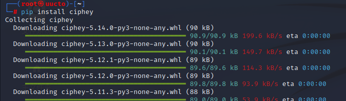

windows下安装首先得有python环境，建议python版本3.7以上，推荐3.8

`pip install ciphey  -i http://mirrors.aliyun.com/pypi/simple/`

`ciphey -t "I44EOOLCIFUDQ5KLME======"`

测试会出来这样的错误提示 ，UnicodeDecodeError: 'gbk' codec can't decode byte 0xbf in position 695: illegal multibyte sequence，

根据错误修改代码，主要是在读取文件的时候发生错误，将"r" 改为"rb"，如下图，问题出在regex_identifier.py,把"r" 改为"rb"。如下图
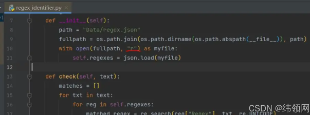

Ciphey还封装了 docker 镜像，也可以直接运行docker容器，命令如下：

`docker run -it --rm remnux/ciphfey`

**¤ 文件输入模式：** 直接将待解码内容以文本的形式传入 Ciphey，输入命令“ciphey -f encrypted.txt“ 即可，其中encrypted.txt中的内容就是输入文本。

**¤ 宽松模式：** 宽松模式指的是格式简单，直接将待解码文本使用双引号约束，并作为参数输入，如：ciphey –— “Encrypted input”。

**¤ 严格模式：** 通过参数 “-t“ 后接待解码内容。如：ciphey –t “Encrypted input”。

> There are 3 ways to run Ciphey.
> 
> 1. File Input `ciphey -f encrypted.txt`
> 2. Unqualified input `ciphey -- "Encrypted input"`
> 3. Normal way `ciphey -t "Encrypted input"`

# **加入自定义算法到** Ciphey

> 试想一下，如果有一天新的编码算法被提出，或者说在CTF竞赛时，参赛者已知某个字符串的编码规则里面存在某一个算法，而该算法并不在Ciphey当中，这将使得Ciphey的实用性大打折扣，所以Ciphey在设计时也意识到了这一点，于是事先就定义好了自定义算法的增加接口，允许使用者增加自定义的解码算法和破译算法。

##### 在Ciphey中加入自定义解码算法

首先创建一个 py 文件，名称可以自定义，但最好是与编码算法名称一致，比如这里取名testLetter.py ，内容大致如下：

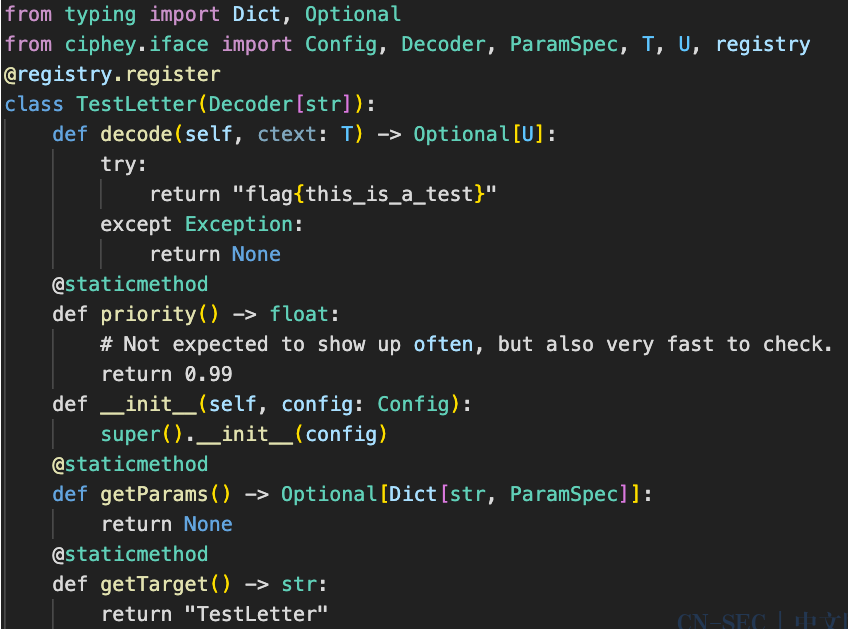

这里需要注意的首先是类名，这类名实际上就表示了编码算法，本例中使用了TestLetter作为演示，函数逻辑则在decode里面实现。为了能让读者更加清晰的看到效果，本解码算法直接返回字符串“flag{this_is_a_test}”。另外需要注意的则是priority函数，priority 表示的是该编码算法的优先权，值越高，表示该算法出现的频率越高，反之则表示算法频率越低。所以在Ciphey中，Unicode 这类常见编码的priority值就相对比较高,达到了0.9，而不常见的一般使用0.05，同样的，为了演示效果，将本编码的priority设置成了0.99。

为了能够在Ciphey中使用新增的解码算法，一般建议将该py文件放置到Ciphey项目中的ciphey/basemods/Decoders目录下，然后重新编译生成模块。但是考虑到很多的使用者仅仅是临时的加入某一个算法，并不需要持久的使用，所以还有另外一种方式增加，直接在使用二进制程序ciphey 时增加参数 -m testLetter.py 即可。具体演示如下图所示，从图中可以看出，解码算法testletter 已经在Ciphey中起到了作用，并且直接输出了testletter 的解码值。

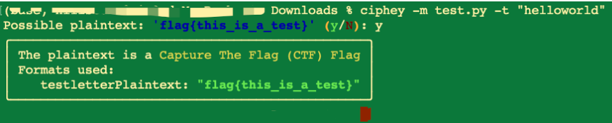

##### 在Ciphey中加入自定义破译算法

和增加自定义解码算法类似的，增加自定义破译算法也是通过编写一个py文件来实现算法。除hash函数以外，其它的绝大多数密码算法都是存在密钥，所以破译算法实际上就是对弱口令的或者密钥空间的穷举。下面通过一个简单的示例来介绍如何添加。

首先新建一个py文件，命名自定义，最好与密码算法相关，本示例使用 testcrack.py，内容如下：

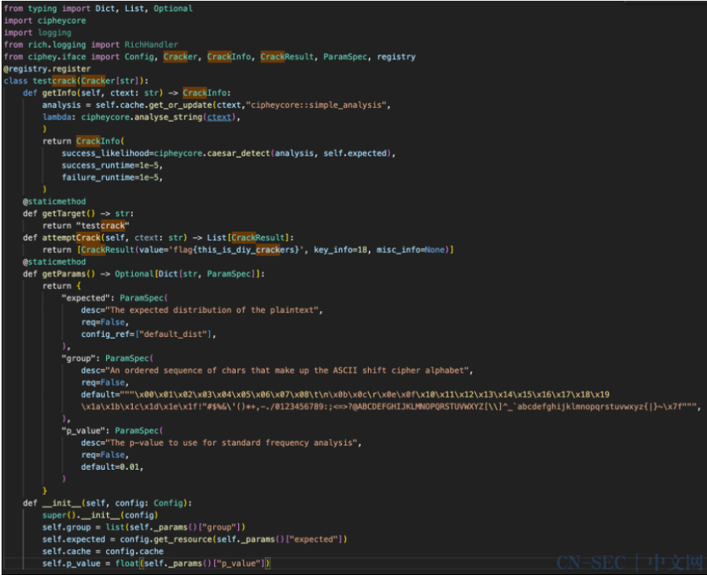

整体的框架和自定义解码函数是一致的，需要特别指出的是 attemptCrack 函数，破译的逻辑就是在这个函数实现。为了方便演示，本示例直接返回了一个字符串“flag{this_is_diy_crackers}” 作为结果，这里需要注意的是，返回的是一个包含CrackResult对象的候选数组。直接使用命令 ciphey -m testcrack.py -t “abs3R4FASF4W34”，即可得到下图所示结果。

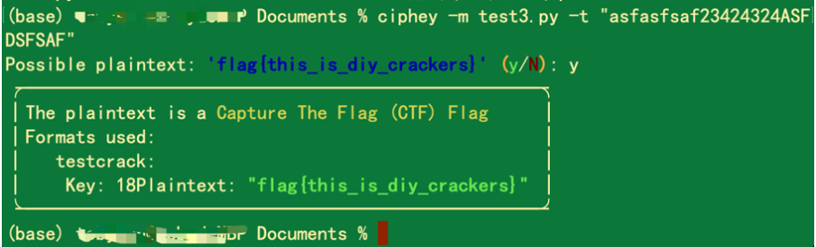

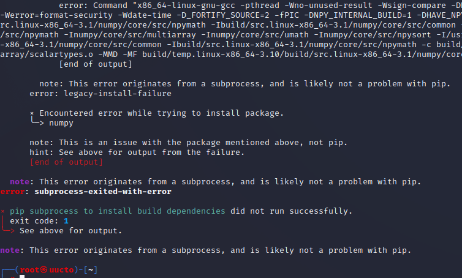

## 在Windows下解决问题

使用anaconda 的虚拟环境，使用python 3.8 及64 位建立tools ：

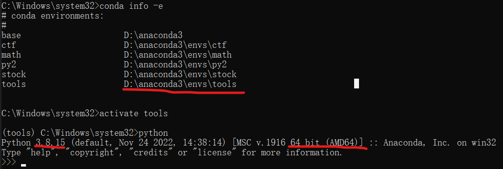

`pip install ciphey -i https://pypi.mirrors.ustc.edu.cn/simple`

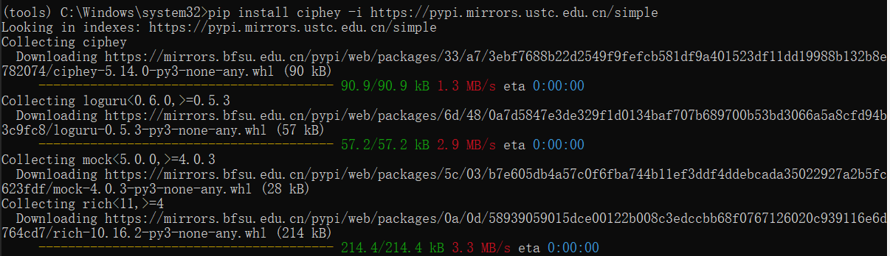

使用中出现如下错误：

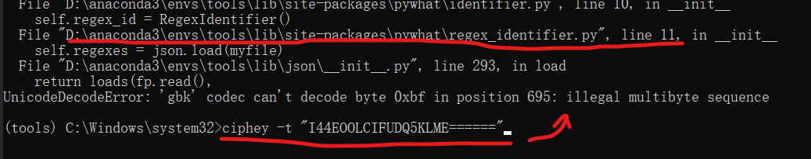在对应的文件位置修改，加上 b ：

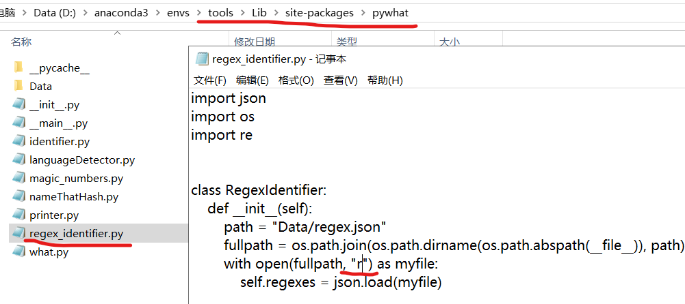

正常使用：

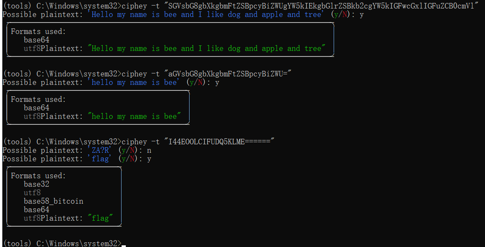

如果不是想要的结果可以输入 n，不是N，继续运算，直至正确结果，如上图。

2022年羊城杯签到题可以直接解答：Misc 签个到 凯撒/ROT13,后base32

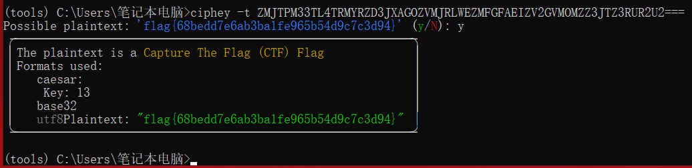
