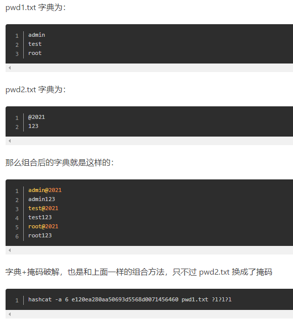
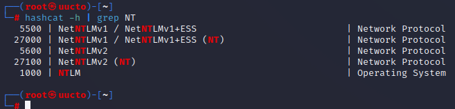
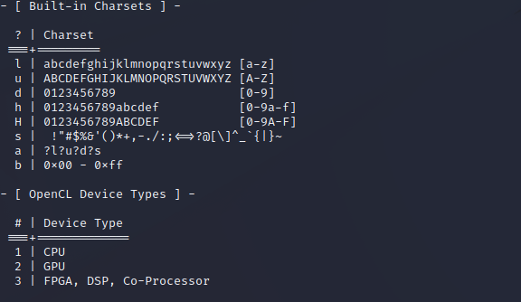
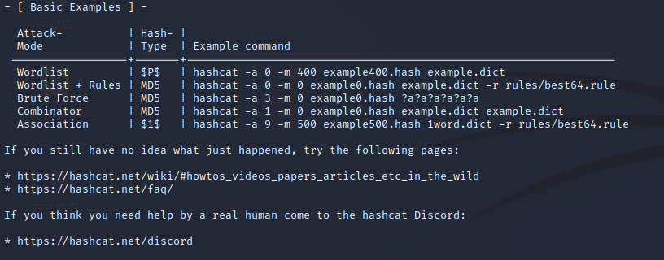
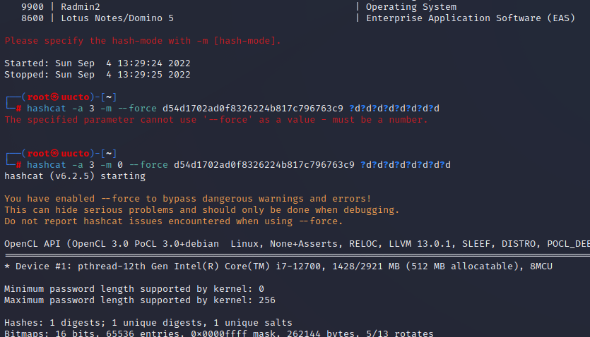
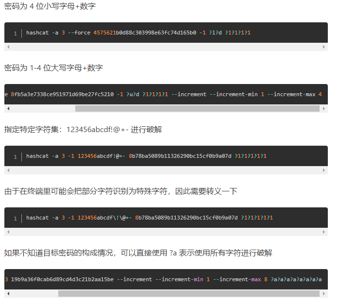
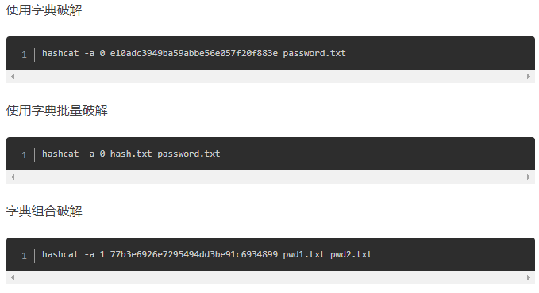

## Hashcat使用教程

Hashcat系列有3个版本，分别是hashcat、 oclhashcat-lite和oclhashcat-plus.
其中hashcat是利用CPU来暴力破解密码的，支持的算法是最多的，但是相比破解速度很慢。
oclhashcat-lite和oclhashcat-plus都是利用GPU来破解密码的，破解速度比利用CPU的hashcat快很多倍。
oclHashcat-plus支持使用GPU破解多个HASH，并且支持的算法高达77种。oclHashcat-lite只支持使用GPU对单个HASH进行破解，支持的HASH种类仅有32种，但是对算法进行了优化，可以达到GPU破解的最高速度。
<mark>以上是对于windows来说的。</mark>

对于想要破解一些未知长度的密码，希望软件在一定长度范围内进行尝试的，可以使用--increment参数，并且用--increment-min ? 定义最短长度，使用--increment-max ? 定义最大长度。比如要尝试6-8位小写字母，可以这样写

`--increment --increment-min 6 --increment-max 8 ?l?l?l?l?l?l?l?l`

不指定字符类型则是

`--increment --increment-min 6 --increment-max 8`

linux系统可以通过 cat /etc/shadow 获取哈希值

hashcat是一款可以基于显卡暴力破解密码的工具

****-a 攻击方式****

```
0 | Straight  字典破解
1 | Combination  组合破解
3 | Brute-force  掩码破解
6 | Hybrid Wordlist + Mask  混合字典 + 掩码
7 | Hybrid Mask + Wordlist  混合掩码 + 字典
9 | Association
```

需要注意上面的1、6和7的组合是如下描述



-m hash加密的类型，最常用为0系MD5加密，默认是MD5类型

当我们想要找一个类型在hashcat支不支持的时候，可以使用



windows系统加密的是NTML，可以看到NTLM的ID号为1000，则使用 -m 1000

-o 将输出结果储存到指定文件  ` -o outfile.txt`

-O 大写，启用优化的内核（限制密码长度）



```
l | abcdefghijklmnopqrstuvwxyz              纯小写字母
u | ABCDEFGHIJKLMNOPQRSTUVWXYZ              纯大写字母
d | 0123456789                              纯数字
h | 0123456789abcdef                        十六进制小写字母和数字
H | 0123456789ABCDEF                        十六进制大写字母和数字
s |  !"#$%&'()*+,-./:;<=>?@[\]^_`{|}~       特殊字符
a | ?l?u?d?s                                键盘上所有可见的字符
b | 0x00 - 0xff                             匹配密码空格
```

```
八位数字密码：?d?d?d?d?d?d?d?d
八位未知密码：?a?a?a?a?a?a?a?a
前四位为大写字母，后面四位为数字：?u?u?u?u?d?d?d?d
前四位为数字或者是小写字母，后四位为大写字母或者数字：?h?h?h?h?H?H?H?H
前三个字符未知，中间为admin，后三位未知：?a?a?aadmin?a?a?a
6-8位数字密码：--increment --increment-min 6 --increment-max 8 ?d?d?d?d?d?d?d?d
6-8位数字+小写字母密码：--increment --increment-min 6 --increment-max 8 ?h?h?h?h?h?h?h?h
```

```
--custom-charset1 [chars]等价于 -1
--custom-charset2 [chars]等价于 -2
--custom-charset3 [chars]等价于 -3
--custom-charset4 [chars]等价于 -4
```

自定义掩码规则，在掩码中用 ?1、?2、?3、?4 来表示。

注意：

- --custom-charset1 abcd ?1?1?1?1?1 等价于 -1 abcd ?1?1?1?1?1
- -3 abcdef -4 123456 ?3?3?3?3?4?4?4?4 表示前四位可能是 adbcdef，后四位可能是 123456

当没有字典的时候，可以使用掩码指定密码的每一位是什么类型的字符，如上图，首先我们知道密码有多少位，例如:`?d?d?d?d?d`代表密码为5为数字，`?u?l?l?l?l?d?d?d123`代表密码为11位，首个字母大写，后面为123。

**使用字典爆破windows hash**  
`hashcat -a 0 -m 1000 hash或者hashfile 字典文件 --force`

在破解后，会在根目录下的`~/.hashcat/hashcat.potfile`文件记录这个hash的缓存,可以删除文件里对应的记录。最好将该文件清空，方便后续破解。

如上图，-D参数指定opencl的设备类型，即CPU还是GPU，虚拟机不支持GPU。GPU破解需要安装显卡对应的驱动，如果电脑有英伟达（NVIDIA RTX/GTX）的独显，可以使用CUDA加速，需要提前安装cuda，这里可以直接使用docker容器。

一般使用 -D 2 指定 GPU 破解

在使用GPU模式进行破解时，可以使用 -O 参数自动进行优化

<mark>Hashcat 参数优化</mark>

```
--gpu-accel 160         可以让GPU发挥最大性能
--gpu-loops 1024        可以让GPU发挥最大性能
--segment-size 512      可以提高大字典破解的速度
```



在linux中，我们知道，密码分别存储在/etc/passwd和/etc/shadow中，只需要`more /etc/shadow`，将其中的文件复制出来，使用工具破解即可，Linux使用的是 sha512crypt加密方式







<mark>基本使用方式 </mark>

hashcat -m 哈希类型 -a 攻击类型 --force hash文件/字符串 字典/掩码

s键查看破解进度，p键暂停，r键继续破解，q键退出破解
