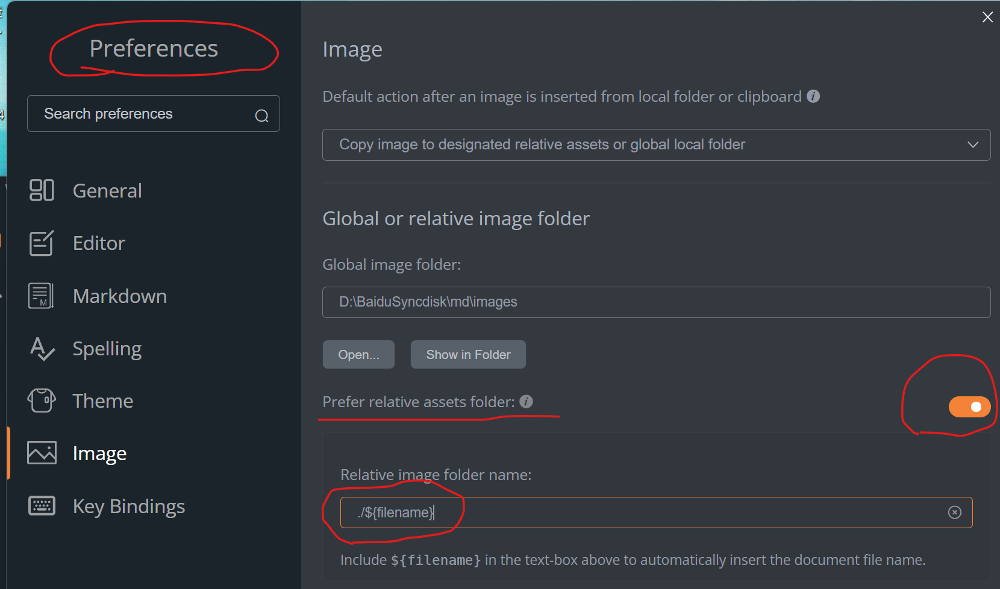
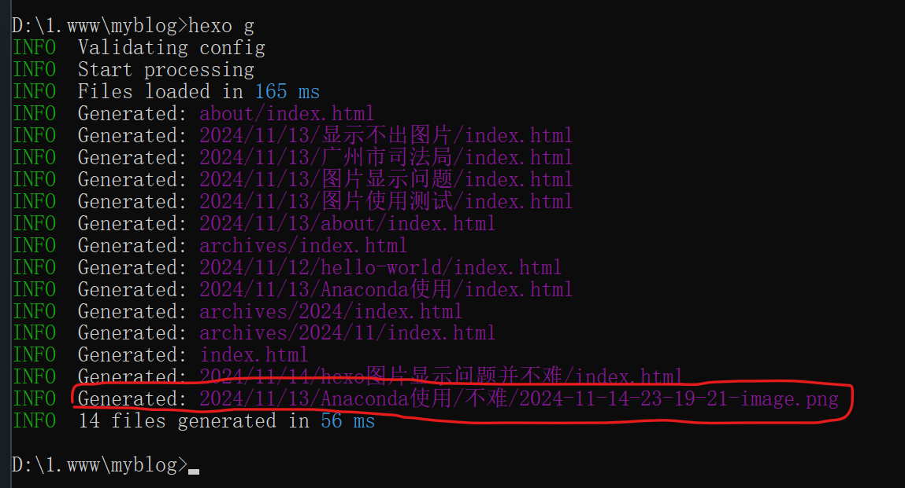
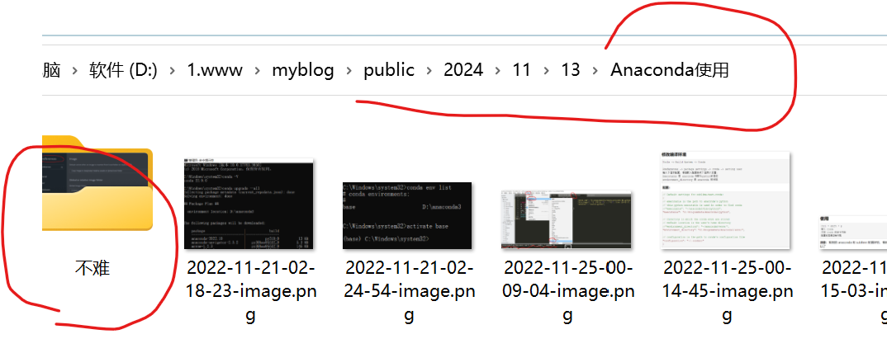
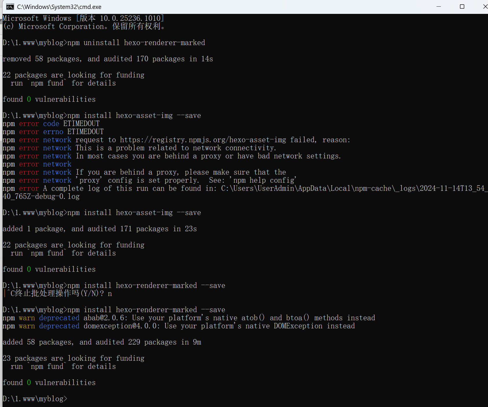

首先要介绍一下我的软件使用版本

执行node -v    npm -v    hexo -v    检测到的版本分别是 v22.11.0    10.9.0    7.3.0

使用的是MarkText.exe 编辑器，在file菜单下的Preferences菜单的Image选项：

上图中，我原来的设置是 ./images/${filename} 所以按网上的配置怎么处理都是有问题不显示图片的，但可以把md文件对应的图片文件夹拷贝到发布后的public文件夹下面的images文件夹也可以正常显示，但这样比较麻烦。

在你的博客文件夹下执行cmd命令并

npm install hexo-asset-img --save

我使用的是上面这个插件，而不是hexo-asset-image，image这个怎么都无法显示图片。

**【将_config.yml 文件中的post_asset_folder 选项设为 true 】**是必须的！只有这样才能在执行hexo g的时候，在public文件夹下对应md文件夹内生成图片。

目前是正常的，但有个问题，新建文件后有图片插入的，需要执行>hexo clean    >hexo g  >hexo s  才能正常显示图片，如果只是>hexo g    >hexo s 还是不正常：

如上图，产生的图片放在了最早的md文件图片文件夹下面，而且还出现了“不难”字样。

按上图，在没有清除public目录后执行>hexo g产生的目录结果是这样的：

最后附上操作截图：

如果问题可以留言进行交流
