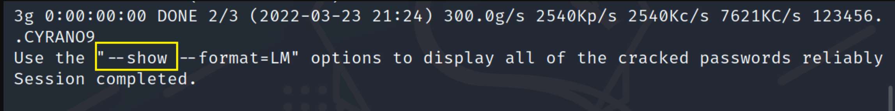
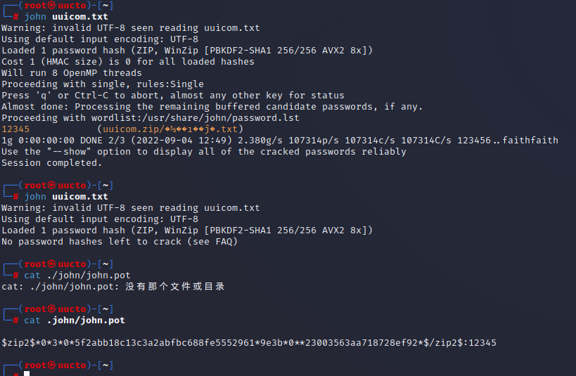
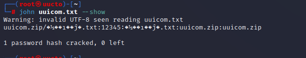
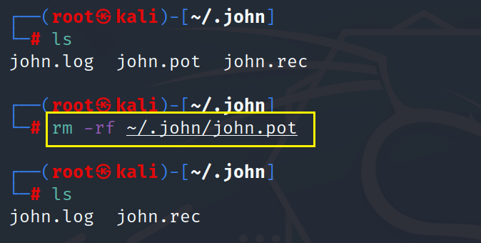
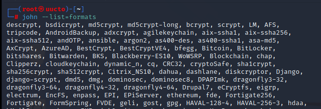
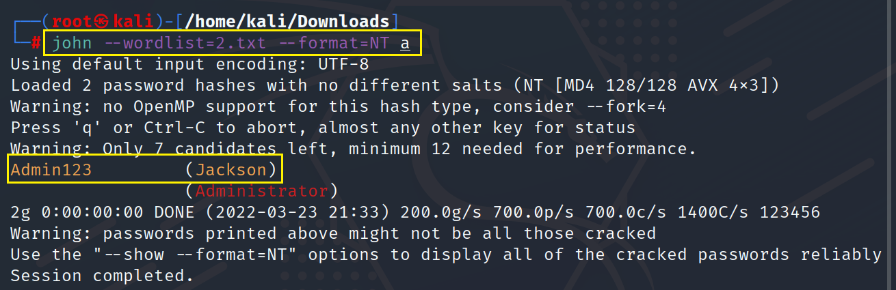
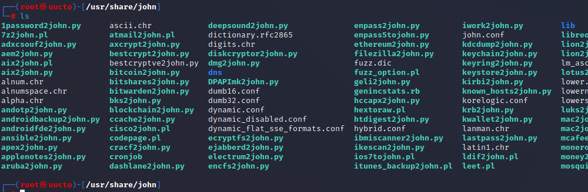
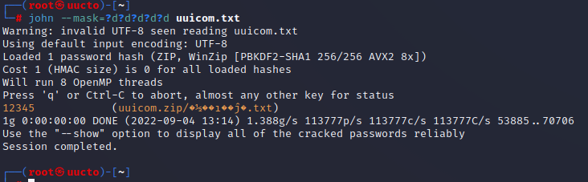
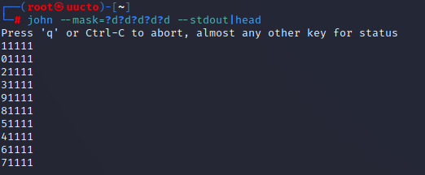

#### john工具破解密码

简单破解

解密这个文件使用 john 自带的一个简单的密码文件，如果猜想用户的密码非常的简单例如 123456 这一类的可以使用这个命令 。比如下面这样。

john passwd.txt
稍高级法

如果我们要破解的用户密码稍微高级一些，比如根据用户名来设置密码，我们就需要John -Single 这个命令，原理是根据用户的名称，加上常见的变化而猜测密码。比如此用户叫test，而他的密码是test123、test1、tset、test123、...。

john --single passwd.txt
自定义字典破解 --wordlist 参数

john --wordlist=big.txt passwd.txt
--rules 参数

-rules参数则在此基础上再加上些变化，如字典中有单词test，则john还会尝试使用tes、teSt、 tset等单词变化进行解密。

john --wordlist=big.txt passwd.txt --rules
--restory 参数

如果在破解密码的过程中由于某些原因中断了破解，使用 restory 继续破解密码 。

--incrementa 参数

使用遍历模式，就是使用字幕数字等组合密码的所有可能情况，一般不用，太浪费时间。如果你电脑速度够快又有足够的时间，可以来使用这种方式，这是威力最大的方式。

--fork 参数

同时开启多少个进程执行

john --format=mysql-sha1 --wordlist=/usr/share/wordlists/rockyou.txt passwd.txt --fork=10
当我们破解成功后，john会将破解成功的hash缓存在我们家目录的`.john/john.pot`文件中，需要我们手动进行删除，否则下次爆破会出现





意思就是让我们`--show`查看破解成功的密码，或者`--format=LM`指定破解类型  
需要手动删除`rm -rf ~/.john/john.pot`





我们知道`windows hash`的加密为`NTLM`，需要我们`--format`指定

`--list=formats`和`--list=subformats`可以查看所支持的破解类型



**不指定破解类型和字典直接破解** john会自动进行使用默认的字典，并识别我们的hash类型进行自动选择



/usr/share/john目录下获取各种格式哈希的脚本工具



命令方式

` /usr/share/john/office2john.py /root/test.docx > docx.txt`

指定掩码模式



```
d=数字
a=键盘95字
l=英文小写
u=英文大写
```

可以提前检查掩码设置是否正确 ` # john --mask=?d?d?d?d?d --stdout|head`


