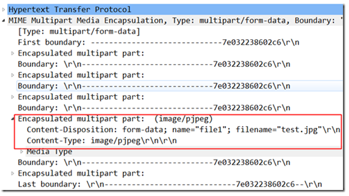
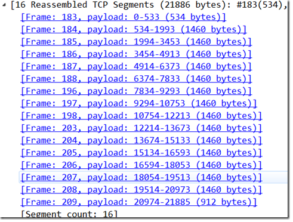
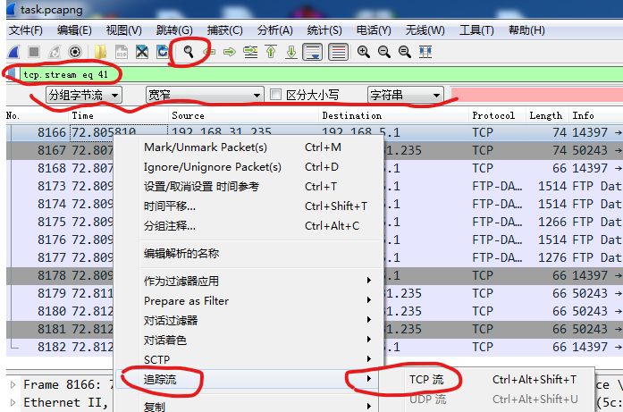
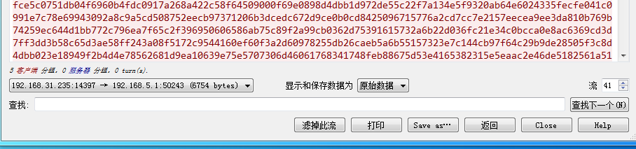

wireshark 跟踪数据流

黑客A通过ARP欺骗，使用Wireshark获取了整个局域网内的网络流量信息。无意之中，他发现有人在某个网站上上传了一份文件。但是他不知道怎么样通过Wireshark去还原这份文件，没办法，他将监听到的数据包保存为了一份Wireshark的监听记录

可以自己准备一张图片test.jpg，并随便找一个允许上传的网站，然后用Wireshark将上传的过程抓包，这里我已经将自己的抓包结果保存成文件catchme.pcapng

使用显示过滤器进行过滤，由于上传文件采用的是HTTP协议，因而使用过滤规则“http”，过滤之后发现数据包由原来的344个变成了137个，这样就很容易帮我们分析了。仔细分析，我们会在第209条数据包的info中看到upload这个词，我们怀疑这条就是涉及到上传的数据包。

由于上传文件都是采用POST方法，因而我们也可以使用过滤规则“http.request.method==POST”进行更精确的过滤，这时就只有47个数据包了。因而掌握数据包过滤，是熟练掌握Wireshark的必备技能之一。

虽然我们看到了有upload关键字，有POST方法，但是我们不能确定是不是真的就是上传文件的那个请求。双击第209号数据包进行专门分析，在应用层数据中可以看到确实是上传了文件，而且文件名是test.jpg。

在传输层部分可以看到，由于文件比较大，TCP协议将其分成了16个数据段Segment，每个数据段都是一个独立的数据包，点击各个Frame，就可以看到数据包中的内容。

但问题是每个数据包中都只包含了上传文件的一部分，要想还原上传的文件，就必须将这些被分片的数据包重新组合成一个整体。在Wireshark中提供了一项“数据流追踪”功能，就可以来完成这项任务。

回到Wireshark的主界面，在209号数据包上点击右键，选择“追踪流/TCP流”，

这时整个TCP流就会在一个单独的窗口中显示出来，我们注意到这个窗口中的文件以两种颜色显示，其中红色用来标明从源地址前往目的地址的流量，而蓝色用来区分出相反方向也就是从目的地址到源地址的流量。

将数据流保存成原始文件，以便下一步处理。需要注意的是，在保存之前一定要将数据的显示格式设置为“<mark>原始数据</mark>”。

这里将文件的扩展名指定为.bin，以使用二进制形式保存文件。
