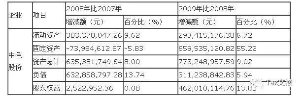

财务报表的使用人有许多种，包括权益投资人、债权人、经理人员、政府机构和其他与企业有利益关系的人士。他们出于不同目的使用财务报表，需要不同的信息，采用不同的分析程序。

(一)债权人

债权人是指借款给企业并得到企业还款承诺的人。债权人关心企业是否具有偿还债务的能力。债权人可以分为短期债权人和长期债权人。

债权人的主要决策：决定是否给企业提供信用，以及是否需要提前收回债权。他们进行财务报表分析是为了回答以下几方面的问题：

1、公司为什么需要额外筹集资金;

2、公司还本付息所需资金的可能来源是什么;

3、公司对于以前的短期和长期借款是否按期偿还;

4、公司将来在哪些方面还需要借款。

(二)投资人

投资人是指公司的权益投资人即普通股股东。普通股股东投资于公司的目的是扩大自己的财富。他们所关心的是包括偿债能力、收益能力以及投资风险等等。

权益投资人进行财务报表分析，是为了回答以下几方面的问题：

1、公司当前和长期的收益水平高低，以及公司收益是否容易受重大变动的影响;

2、财务状况如何，公司资本结构决定的风险和报酬如何;

3、与其他竞争者相比，公司处于何种地位。

(三)经理人员

经理人员是指被所有者聘用的、对公司资产和负债进行管理的个人组成的团体，有时称之为"管理当局"。

经理人员关心公司的财务状况、盈利能力和持续发展的能力。经理人员可以获取外部使用人无法得到的内部信息。他们分析报表的主要目的是改善报表。

(四)政府机构有关人士

政府机构也是公司财务报表的使用人，包括税务部门、国有企业的管理部门、证券管理机构、会计监管机构和社会保障部门等。他们使用财务报表是为了履行自己的监督管理职责。

(5) 其他人士

财务报表分析对于了解企业的财务状况和经营业绩，评价企业的偿债能力和盈利能力，制定经济决策，都有着显着的作用。但由于种种因素的影响，财务报表分析及其分析方法，也存在着一定的局限性。在分析中，应注意这些局限性的影响，以保证分析结果的正确性。

**（1）会计处理方法及分析方法对报表可比性的影响。**

会计核算上不同的处理方法产生的数据会有差别。例如固定资产采用直线折旧法或采用加速折旧法，折旧费也不同。企业长期投资采用成本法与采用权益法所确认的投资收益也不一样。因此，如果企业前后期会计处理方法改变，对前后期财务报表对比分析就会有影响。同样，一个企业与另一个企业比较，如果两个企业对同一事项的会计处理采用的方法不一样，数据的可比性也会降低。所以在分析报表时，一定要注意看附注，看看企业使用的是什么方法以及方法有无变更等。

从财务报表分析方法来看，某些指标计算方法不同也会给不同企业之间的比较带来不同程度的影响。例如应收账款周转率、存货周转率等，其平均余额的计算，报表使用者由于数据的限制，往往用年初数与年末数进行平均，这样平均计算应收账款余额与存货余额，在经营业务一年内各月各季较均衡的企业尚可，但在季节性经营的企业或各月变动情况较大的情况下，如期初与期末正好是经营旺季，其平均余额就会过大，如是淡季，则又会过小，从而影响到指标的准确性。

此外，财务报表分析、指标评价要与其他企业以及行业平均指标比较才有意义。但各企业不同的情况，如环境影响、企业规模、会计核算方法的差别，会对可比性产生影响。而行业平均指标，往往是各种各样情况的综合或折衷，如果行业平均指标是采用抽样调查得到的，在抽到极端样本时，还会歪曲整个行业情况。因此，在对比分析时，应慎重使用行业平均指标，对不同企业进行比较时应注意调整一些不可比因素的影响。

**（2）通货膨胀的影响。**

由于中国的财务报表是按照历史成本原则编制的，在通货膨胀时期，有关数据会受到物价变动的影响，使其不能真实地反映企业的财务状况和经营成果，引起报表使用者的误解。例如，以历史成本为基础的资产价值必然小于资产当前的价值，以前以500万元购买的固定资产，重置成本可能为800万元，但账上及报表上仍反映为500万元固定资产原价。如不知道该资产是哪一年买的，仅仅靠这个数据，不能正确理解一个企业的生产规模。进一步说，折旧费是按固定资产原价提取的，利润是扣减这种折旧费计算出来的，由于折旧费定低了，企业将无力重置价格已上涨的资产；同时由于折旧费定低了，利润算多了，可能会导致企业多交所得税，多付利润，最终可能使企业的简单再生产也难以维持。

**（3）信息的时效性问题。**

财务报表中的数据，均是企业过去经济活动的结果。用这些数据来预测企业未来的动态，只有参考价值，并非绝对合理可靠。而且等报表使用者取得各种报表时，可能离报表编制日已过去多日。

**（4）报表数据信息量的限制。**

由于报表本身的原因，其提供的数据是有限的。对报表使用者来说，可能不少需要使用的信息，在报表或附注中找不到。

**（5）报表数据的可靠性问题。**

有时，企业为了使报表显示出企业良好的财务状况及经营成果，会在会计核算方法上采用其他手段来粉饰财务报表。这时财务报表分析就容易误入歧途。

以上关于财务报表分析及其分析方法局限性的种种说明并不能否定财务报表分析的积极作用，了解这些局限性，分析报表时注意它们的影响，可以提高财务报表分析的质量。

此外，报表使用者在阅读和分析企业财务报表时，一定不要忽略报表附表和附注。仔细阅读有关附表和附注，能使人们正确理解报表上所反映的信息，不至产生错误的判断和结论。同时，在阅读报表时，还应注意注册会计师\"审计报告\"的意见。注册会计师从第三者公正的立场，从专业人士的角度，对企业报表数据是否真实、可靠、可验证等方面的评价，对于报表使用者是很有用的。

## **一个经典的公司财务报表分析案例，很详细！**

会计学堂

百家号18-09-0913:47

标题说是经典的案例分析，实际上也就是一个普通的分析。会计的东西太多，教科书上的东东太多。而结合企业战略、市场的变化、同行的情况、内部的管理、制度以及会计政策，等方面，分析的太少。所以，本文仅适用于财务经理级别以下的人员，是有用的。可以上交给财务经理，供其进一步分析和提炼，才能上交到最高管理层。

1.中色股份有限公司概况

中国有色金属建设股份有限公司主要从事国际工程承包和有色金属矿产资源开发。1997年4月16日进行资产重组，剥离优质资产改制组建中色股份，并在深圳证券交易所挂牌上市。

目前，中色股份旗下控股多个公司，涉及矿业、冶炼、稀土、能源电力等领域；同时，通过入股民生人寿等稳健的实业投资，增强企业的抗风险能力，实现稳定发展。

2.资产负债比较分析

资产负债增减变动趋势表

01.增减变动分析

从上表可以清楚看到，中色股份有限公司的资产规模是呈逐年上升趋势的。从负债率及股东权益的变化可以看出虽然所有者权益的绝对数额每年都在增长，但是其增长幅度明显没有负债增长幅度大，该公司负债累计增长了20.49%，而股东权益仅仅增长了13.96%，这说明该公司资金实力的增长依靠了较多的负债增长，说明该公司一直采用相对高风险、高回报的财务政策，一方面利用负债扩大企业资产规模，另一方面增大了该企业的风险。

（1）资产的变化分析

08年度比上年度增长了8%，09年度较上年度增长了9.02%；该公司的固定资产投资在09年有了巨大增长，说明09年度有更大的建设发展项目。总体来看，该公司的资产是在增长的，说明该企业的未来前景很好。

（2）负债的变化分析

从上表可以清楚地看到，该公司的负债总额也是呈逐年上升趋势的，08年度比07年度增长了13.74%，09年度较上年度增长了5.94%；从以上数据对比可以看到，当金融危机来到的08年，该公司的负债率有明显上升趋势，09年度公司有了好转迹象，负债率有所回落。我们也可以看到，08年当资产减少的同时负债却在增加，09年正好是相反的现象，说明公司意识到负债带来了高风险，转而采取了较稳健的财务政策。

（3）股东权益的变化分析

该公司08年与09年都有不同程度的上升，所不同的是，09年有了更大的增幅。而这个增幅主要是由于负债的减少，说明股东也意识到了负债带来的企业风险，也关注自己的权益，怕影响到自己的权益。

02.短期偿债能力分析

（1）流动比率

该公司07年的流动比率为1.12，08年为1.04，09年为1.12，相对来说还比较稳健，只是08年度略有降低。1元的负债约有1.12元的资产作保障，说明企业的短期偿债能力相对比较平稳。

（2）速动比率

该公司07年的速动比率为0.89，08年为0.81，09年为0.86，相对来说，没有大的波动，只是略呈下降趋势。每1元的流动负债只有0.86元的资产作保障，是绝对不够的，这表明该企业的短期偿债能力较弱。

（3）现金比率

该公司07年的现金比率为0.35，08年为0.33，09年为0.38，从这些数据可以看出，该公司的现金即付能力较强，并且呈逐年上升趋势的，但是相对数还是较低，说明了一元的流动负债有0.38元的现金资产作为偿还保障，其短期偿债能力还是可以的。

03.资本结构分析

（1）资产负债率

该企业的资产负债率07年为58.92%，08年为61.14%09年为59.42%。从这些数据可以看出，该企业的资产负债率呈现逐年上升趋势的，但是是稳中有降的，说明该企业开始调节自身的资本结构，以降低负债带来的企业风险，资产负债率越高，说明企业的长期偿债能力就越弱，债权人的保证程度就越弱。该企业的长期偿债能力虽然不强，但是该企业的风险系数却较低，对债权人的保证程度较高。

（2）产权比率

该企业的产权比率07年为138.46%，08年为157.37%，09年为146.39%。从这些数据可以看出，该企业的产权比率呈现逐年上升趋势的，但是稳中有降的，从该比率可以看出，该企业对负债的依赖度还是比较高的，相应企业的风险也较高。该企业的长期偿债能力还是较低的。不过，该企业已经意识到企业的风险不能过大，一旦过大将带来重大经营风险，所以，该企业试图从高风险、高回报的财务结构向较为保守的财务结构过渡，逐渐增大所有者权益比例。

（3）权益乘数

该企业的权益乘数07年为2.38，08年为2.57，09年为2.46。从这些数据可以看出，该企业的权益乘数呈现逐年上升趋势的，但是也是稳中有降的。说明一开始企业较多依赖负债，当意识到带来的企业风险也较大时，股东就加大了权益性资产投入，增大了权益性资本在资产总额中的比重，选择调整为稳健的财务结构，于是降低了权益乘数，使公司更好地利用财务杠杆的作用。

04.长期偿债能力分析

（1）利息保障倍数

该企业的资产负债率07年为10.78，08年为2.92，09年为3.19。从这些数据可以看出，该企业的利息保障倍数呈现逐年下降的趋势。08年金融危机来的当年影响最大，后又缓慢上升，说明企业经营开始好转。利息保障倍数越高，说明企业偿还债务能力越有保障，该企业07年到09年期间，利润有了大幅下降，而同时财务费用却有进一步增长，对债务的偿还能力有所降低，所以应该要多加注意。

（2）有形资产净值债务率

该企业的有形资产净值债务率07年为203.64%，08年为227.15%，09年为205.51%。从这些数据可以看出，该企业的有形资产净值债务率是呈现逐年上升趋势的，但是也是稳中有降的。该项指标越大，企业的经营风险就越高，长期偿债能力就越弱。以上数据可以看出，该企业正在努力降低该指标，以进一步有效提高企业的长期偿债能力。

## **看商誉排雷：如何从财务报表辨别"地雷"公司**

启智得宁

百家号18-12-1117:26

随着中国经济国际化进程的不断推进，今年，一系列改革措施陆续推出，包括停复牌制度、回购制度，信息披露制度等，资本市场也逐步开始与国际接轨。中国股市也在一步步走向成熟，投资方式也会有别于以往，不可避免，价值投资会成为未来的主流。

说到价值投资，那就离不开财务报表，中国会计准则发展要晚于国际主流国家，与国际接轨也是在加入WTO之后，直到现在仍然存在较多不完善的地方。

会计准则的不完善外加上市公司财务报表粉饰的手段越来越多，让一些非专业的人士在做股票投资时频频踩雷，以下介绍商誉排雷的方式，让我们以后的投资路上少踩"地雷"。

先说一下商誉的概念：一家公司收购另一家公司支付的价格超过被收购公司的公允价值部分叫商誉。举个例子,A公司收购B公司，假如B公司是上市公司，B市值是2亿，A公司出资2.5亿收购，那么商誉就是5000万。

这里可简单理解为一个东西市场价值只值5块钱，但要花10块钱去买，多出来的部分就是商誉。为什么要多花钱去买呢，通常是因为被收购企业会与母公司产生协同效应，也就是1+1大于2的效应。

但这也就产生了一个问题，如果被收购公司不能产生协同效应，且质地非常差，未来也不能给企业带来利润增长，但仍然花大价格去买，这中间很可能就涉及到利益输送。

假如与上市公司高层有利益牵扯的人，随便做一家公司，之后上市公司有高价收购回去。这样就把上市公司的资金转移过去了，而通常来讲上市公司是全体股民所以，使用超过企业本身价值的高价收购损失的也是全体股民。完成上面这样的收购，通常就会产生商誉，商誉就会在母公司财务报表中体现出来。

这个套路影视行业玩的最厉害，从行业的财务就看的出来，某上市公司影视娱乐公司旗下的艺人随便成立一个工作室，然后上市公司就斥巨资来收购，间接就完成了资产转移，这样在母公司财报里面产生天量商誉。大家可以看看，目前影视类公司的商誉普遍占净资产达到30%以上。如果两公司没任何协同效应，这些商誉价值也就为零，但仍几十上百亿的挂在资产负债表中的资产项目中。而且这些商誉地未来公司赚钱时还会做减值测试，也就是说会从利润里面扣除，直接就影响公司净利润。

因此，在做投资时，很简单，打开财务报表，翻到资产负债表，看资产项目下商誉有多少，再看商誉占净资产的比率，只要占比达到10%以上的就可以排除，或许可能错过一些好公司，但绝对能规避一大批成心思不正的上市公司。
