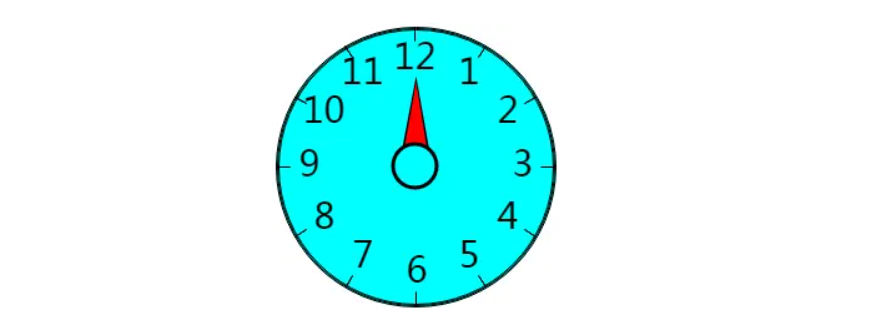
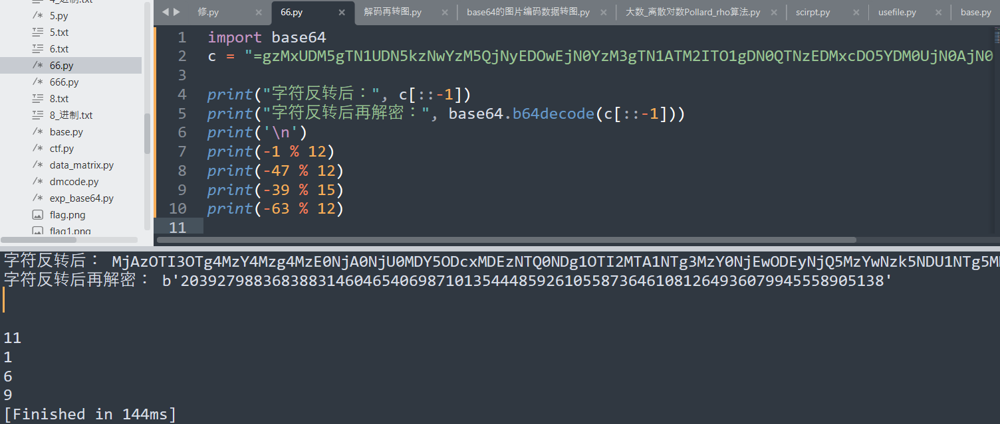

# 密码学家的数学：模（MOD)运算

模算法是密码学中的核心数学概念。

从凯撒密码到RSA密码，几乎任何密码都会用到模运算。

因此，我将在这里教大家怎么进行模加法、模减法、模乘法、模除法和模幂运算。

这是一个很容易理解的概念，让我们开始吧:

Mod、模数和模运算是什么意思？

“模数”(缩写为“mod”)，在拉丁语中是“余数、残数”的意思，表示“取去整体的一部分后剩下的部分”。

因此，“模”或“模运算”实际上是“余数算术”。

更精确地说:我们正在寻找一个整数除以另一个整数时作为余数出现的整数(或“剩余值”)。

让我们举三个例子:

例子1：

当7除以3时，余数是1。

我们可以理解为，你本身有7块钱，平分给3个人后，最后你只剩下一块钱。

当然，我们也可以用模运算的方式表示:

7 = 3X2 + 1，其中1是我们需要的整数余数:

7 mod 3 = 1

其读成7的3模等于1.

例子2：

当8除以3时，剩下的余数是2。因此，我们写成:

8 mod 3 = 2

例子3：

当9除以3时，它没有余数。因此，我们写成:

9 mod 3 = 0

关于确定余数的计算称为“模运算”。它在1801年由德国数学家卡尔·弗里德里希·高斯首次研究了这一理论。

你可能听过你的数学老师说过关于高斯的故事，一天，高斯的老师布置了一道题，1+2+3······这样从1一直加到100等于多少。

高斯很快就脱口而出：5050，因为1+100=101，2+99=101······50+51=101。从1加到100有50组这样的数，所以50X101=5050。”

这当然也适用于大数据:

例如365 MOD 7 = 1 (因为365 = 52 X 7 + 1 )

下面我在说说全等数：

当除以某个模数时，其余数的整数是相似的，但是不相同。这些数字就称为“全等数”。

例如，1和13以及25、37是全等mod 12，因为它们在除以12时余数都是相同的。

我们可以把它写成1 = 13 = 25 = 37 mod 12。

一些注意的要点：

1、关于负数计算，例如-12的MOD22

遇到负数就不能使用，12除以22才计算余数，而是22除以12来计算余数。

2、当整数比被除数小时怎么运算，比如说2mod15等于多少？

答案是等于2。

模运算有时候也称为时钟运算。你可以看看你房间里那个12小时的时钟。

你在钟上看到了12个数字，这里，模数为12，剩余的12个模数为0、1、2，..11，所以，当你给出时间时，你实际上给出了一个介于0和11之间的余数。同样，模数m = 12负责提醒你。

在模运算中，我们加、减、乘、除和取幂的方法如下:

1、模加法：

让我们从最简单地开始: 现在是11点，10小时后是几点？

它是11 + 10 = 21点，21减去模数12剩下9的余数，因此是9点。

现在是11点，22小时后是几点？

它是11 + 22 = 33，并且减去模数12 (有也称为“除”)再次得到结果9点。忽略上午和下午，因为我们是在时钟上进行mod运算。

让我们用mod算法写出两个例子:

11 + 10 = 21 mod 12 = 9

11 + 22 = 33 mod 12 = 9

从上面的例子上，我们可以看到模加法的计算原理是:先将这两个数字相加，然后将总和除以模数以计算余数。

2、模减法：

模减法也是用类似的方式进行:

先减，然后计算余数。

例子1：25 - 8 = 17 MOD 12 = 5

例子2 : 50 - 11 = 39 MOD 12 = 3

如果我们计算出的结果是错误的呢？

例如：假设现在是纽约2点，洛杉矶是几点？

将指针向后转动3小时，因为纽约时间比洛杉矶时间快3小时

2 - 3 = - 1 MOD 12 = 11

这个计算显然是错误的，出现这种情况，我们需将模数相加，得到一个整数。该数字必须介于0到模数之间的数字。

例子3 : 3 - 50 = - 47 MOD 12 = 1，因为- 1 + 12 = 11，12-11=1

例子4 : 14 - 77 = - 63 MOD 12 = 9，因为- 63 + 12 + 12 + 12 + 12 + 12 = -3，12-3=9

例子5 : 50 - 11 = - 39 MOD 15 = 6，因为- 39 + 15 + 15 = -9,15-9=6

3、模乘法

由于整数的乘法其实就是重复加法，因此可以将其简化为上述模加法。

我们怎么计算5 X8 MOD 12？

首先我们先乘: 5X 8 = 40

然后，我们就找到了余数: 40 MOD 12 = 4。

Mod算法的3个计算规则：

1. a + b mod m = (a mod m) + (b mod m)

2. a - b mod m = (a mod m) - (b mod m)

3. a Xb mod m = (a mod m) X (b mod m)

3、模除法

模除法其实是乘法的逆运算。这意味着可以通过“查找剩余余数”在进行模乘法来解决。

例子：

为了计算5 ÷7 mod 12，我们引入了一个x

x = 5 ÷ 7 mod 12，将两侧乘以7

7x = 5mod12

我们通过测试12个不同的余数0，1，...11

然后得到x = 11，因为

7 X11 mod 12 = 77 mod 12 = 5

如果模数如上所述很小，反复试验就会找到答案。但是如果模数大，测试每个余数需要花费很长时间。

当然，我们可以写个程序让计算机为我们做测试。

不过，还有另外一种直接的方法来进行模除法:

为了计算5 ÷7 mod 12

我们首先，就像上面那样，将两边乘以7 :

x X7 = 5 mod 12

为了隔离x，我们简单地将两边乘以7 mod 12的倒数，这是因为7X7 mod 12 = 49 mod 12 = 1。

现在，我们把两边乘以7，左边是x，右边是7X 5 mod 12 = 35 mod 12 = 11。

因此，x = 11mod12或5 / 7 = 11mod12。

计算完成。

4、模幂运算

在RSA密码的加密过程中，会用到模幂运算。

由于模幂运算是重复乘法，因此可以将其简化为上述模乘法。

我们如何计算34 MOD 12？

首先我们相乘: 3 X 3 X 3 = 81，

然后，我们找到余数: 81 mod 12 = 9

怎么计算大数据呢？例如115 mod 10

我们先计算( 11 mod 10 ) = 1，并将答案乘以5倍，得到答案1

用这种快捷方法，125 mod 10的答案为2，因为12 mod 10 = 2和25 mod 10 = 32 mod 10 = 2。

原理 :不需要先计算(大)幂，然后再找到余数，而是先找到较小幂的余数，然后对它们进行模乘法，得到最终答案
